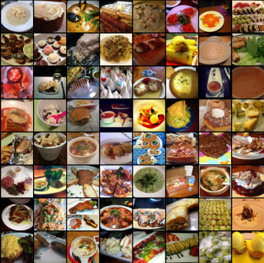
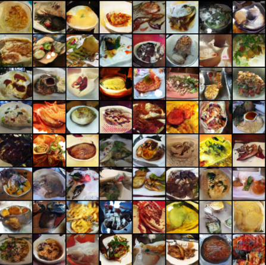

# FoodGAN
This repo implements some GAN-based architecture for generating food images.

# Results

## Real Sample

## Baseline model
[Deep Convolutional GAN](https://arxiv.org/abs/1511.06434)(DCGAN)

